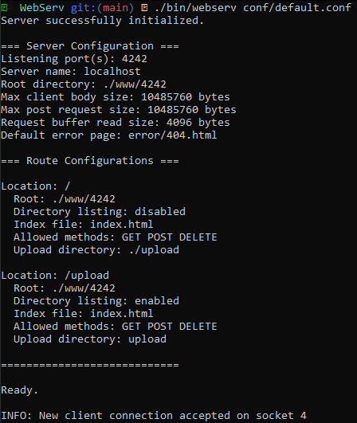
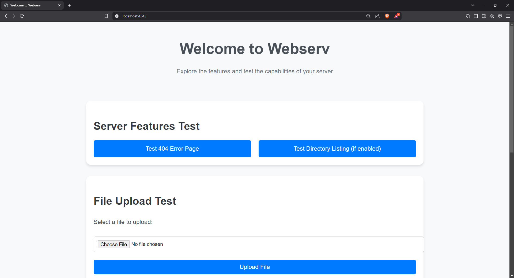
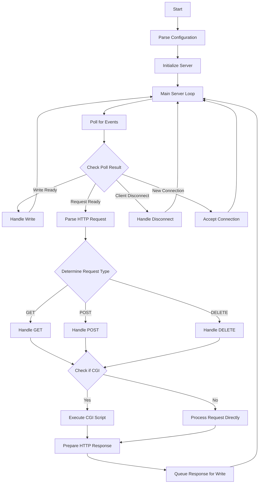

<h1 align="center">✨ WebServ ✨</h1>

<h6 align="center"><em>High performance C++ HTTP web server</em></h6>

## 📝 Overview

This project is an HTTP web server that implements the [RFC 2616 HTTP/1.1 Standard](https://datatracker.ietf.org/doc/html/rfc2616).<br>
It was developed in collaboration with Luca Goddijn as part of our curriculum.

View the project's requirements and guidelines here: [subject](./extra/en.subject.pdf)

The server is written in C++ and compiled using the C++20 standard. While the original project guidelines specify C++98, our specific campus disregards this, allowing any standard, therefore we opted for C++20 due to preference and feature coverage.

The project was developed over the span of 2 days, while we have gone through efforts to make the code readable and coherent, some minor sections might still feel a bit "rushed" in terms of readability.

The server is targeted for linux platforms via the [g++](https://gcc.gnu.org/) or [clang++](https://clang.llvm.org/) compilers.<br>
These requirements are automatically checked at compile time via the makefile.

### Results

| Evaluation Score |
|:----------------:|
|  |

<h6><em>The bonus was not done for this project</em></h6>

## ✨ Features

- CGI support
- No external dependencies
- Fully documented functions
- Highly performant
- Thoroughly tested
- Highly configurable
- Single `poll()` mechanism
- No blocking operations
- Multi server support
- RFC 2616 HTTP/1.1 Standard support
- GET, POST and DELETE request support

## 🌌 Showcase

| Running WebServ |
|:---------------:|
|  |
| <b>Serving a Website</b> |
|  |

## 🚀 Installation

### 🎉 Precompiled

To avoid compiling from source,<br>
download a precompiled version here:

| Release | Binary |
|:--------|:-------|
| 1.0 | [webserv](https://github.com/DontCallMeLuca/WebServ/releases/download/v1.0/webserv) |
| 1.1 | [webserv](https://github.com/DontCallMeLuca/WebServ/releases/download/v1.1/webserv) |

### 🌐 Requirements

- Any linux platform
- [g++](https://gcc.gnu.org/) or [clang++](https://clang.llvm.org/)
- [make](https://www.gnu.org/s/make/manual/make.html)

### ⭐ Getting Started

1. Clone the repository:

```sh
git clone https://github.com/DontCallMeLuca/WebServ.git
```

2. cd into it:

```sh
cd WebServ
```

### ⚙ Makefile

The project is compiled using [make](https://www.gnu.org/s/make/manual/make.html):

#### Build Release

```sh
make all
```

#### Buld Debug

```sh
make debug
```

#### Clean Build

```sh
make clean
```

#### Delete Build

```sh
make fclean
```

#### Rebuild

```sh
make re
```

## 💻 Usage

### ✨ Quick Start

Running webserv is as easy as:

```sh
./webserv conf/default.conf
```

You just need to provide it with a configuration file.

You can find some example configuration files which cover a series of basic use cases in the [conf](./conf/) directory.<br>
As shown in the previous example, you can use one to start your server.

Along side the configuration files, you can also find example websites, which we personally used in our evaluations for the project in the [www](./www/) directory. These websites were all made by us in an effort to showcase the project coherently for the evaluations, they can hopefully serve you with a basic understanding of the setup.

### ⚙ Configuration

To visualize a basic example configuration, see [default.conf](./conf/default.conf)

#### Server block

A server block must be provided:

```conf
server {
	# ...
}
```

Inside, all other configuration properties must be included.<br>
Multiple server blocks can be provided to host multiple servers at once.<br>
See [twin_servers.conf](./conf/twin_servers.conf) for more

--------

```html
listen <port>;
```

The server listening port, any valid port number.

--------

```html
server_name <host>;
```

The server hostname, any valid address, dns or localhost.

--------

```html
root <root_directory>;
```

The server's root directory, any valid directory (e.g. `/www/4242`)

--------

```html
client_max_body_size <size>;
```

The maximum http request body size in bytes.<br>
Units are supported: 'K' (kilobytes) or 'M' (megabytes), no unit for bytes.

--------

```html
client_max_post_request_size <size>;
```

The maximum post request size, useful for limiting large file uploads.<br>
Units are supported: 'K' (kilobytes) or 'M' (megabytes), no unit for bytes.

--------

```html
request_read_buffer_size <size>;
```

The socket read buffer size, leave as `default` (4096 bytes) if unsure.<br>
Units are supported: 'K' (kilobytes) or 'M' (megabytes), no unit for bytes.

--------

```html
error_page <http_code> <response_file_path>;
```

The default error page for a given http error code

Example:

```conf
error_page 404 error/404.html;
```

#### Location Block

Location blocks specify URL routes (e.g. website.com/images, where /images is the route).
Optionally specify any arguments within the block, no single option is required to be specified.

They can be specified within the server block as:

```conf
location /route {
	# ...
}
```

Example:

```conf
server {

	# ...

	# Root route
	location / {
		# ...
	}

	# images route
	location /images {
		# ...
	}
}
```

--------

```html
index <index_file>;
```

The index file to serve (e.g. index.html).<br>
Consider this is expected in the root directory of the server.

--------

```html
allowed_methods <method1> <method2> <method3>;
```

The allowed http methods for the route, valid methods include: `GET`, `POST` and `DELETE`.<br>
You could optionally specify any, all or no methods.

--------

```html
redirect <route>;
```

The route to redirect a given route to (e.g. `/docs` -> `/images`, docs redirects to images).<br>
They must always be specified with a `/` at the start of the route. See [redirections.conf](./conf/redirections.conf) for more.

--------

```html
root <root_directory>;
```

The root directory path on the system for the given route.
The path is relative to the current working directory for the webserv binary.

Example:

```conf
root ./www/8080;
```

--------

```html
directory_listing <option>;
```

If the route should provide the directory listing (i.e. a list of files and subdirs in the route's directory).

It supports `on` or `off` as valid options.

--------

```html
cgi_handler <script_extension> <script_executor>;
```

The cgi handler for the route.

The server's cgi handler supports python (.py), php (.php) and perl (.pl).

See [cgi.conf](./conf/cgi.conf) for more.

Example:

```conf
cgi_handler .php /usr/bin/php-cgi;
```

## 📊 Visualization

<h6><em>Please note that the following visualization is an oversimplified version of the program.</em></h6>
<br><br>



## ⚠ Limitations

- Linux only
- No log file support
- g++ or clang++ only
- No cookie support
- Limited CGI support

## 💡 Feedback

If you have any feedback, including suggestions, bug reports, or potential vulnerabilities, please don't hesitate to submit them in the [issues](https://github.com/DontCallMeLuca/WebServ/issues) section. If applicable, kindly provide detailed descriptions and replication steps to help me address them effectively.

## 📃 License

This project uses the `GNU GENERAL PUBLIC LICENSE v3.0` license
<br>
For more info, please find the `LICENSE` file here: [License](LICENSE)
